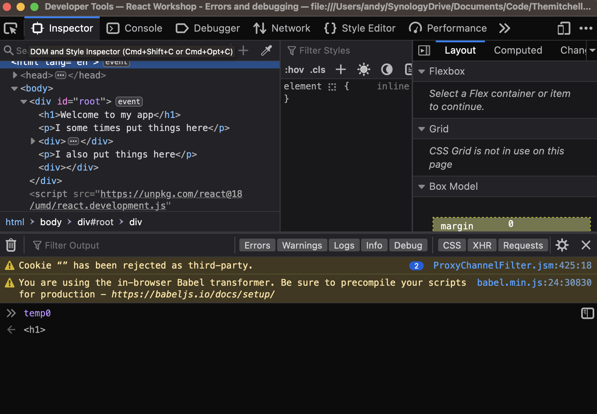
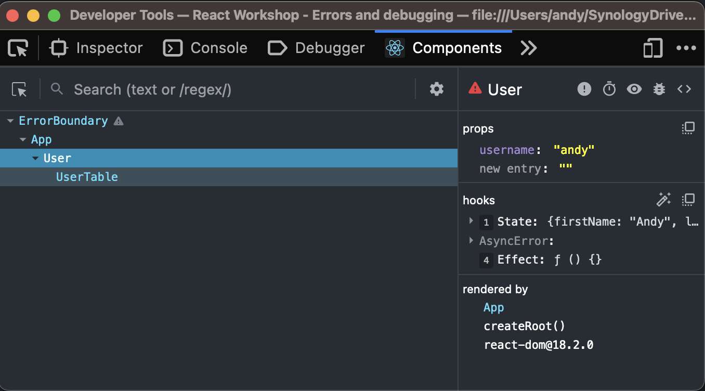

<!---
marp: true
theme: uncover
class: invert
headingDivider: 2
paginate: true
header: 
footer: 'Created with [Marp](https://marp.app) and [Github Pages](https://pages.github.com)'
backgroundImage: url('img/react-logo.svg')
backgroundPosition: 120% 120%
backgroundSize: 40%
style: |
  section,
  section code {
    font-size: 30px;
    text-align: left;
  }

  section ul,
  section ol,
  section img {
    margin-left: 0;
  }

  section.long p,
  section.long ul,
  section.long ol,
  section.long code, {
    font-size: 24px;
  }

  section .columns img {
    width: 100%;
  }

  section .columns {
    display: grid;
    grid-template-columns: repeat(2, minmax(0, 1fr));
    gap: 1rem;
  }

  section header img {
    height: 100px;
    width: 100px;
    float: right;
  }
--->

# React Workshop

Errors and debugging


# Error handling

<div class="columns">

- Use catch to capture errors and store them at the component level in state
- Use the error state to render component level errors as feedback to the user
- Be careful what you catch and tell the user about

```jsx
function User ({ username }) {
  const [user, setUser] = React.useState({});
  const [error, setError] = React.useState(null);

  React.useEffect(() => {
    fetchUser(username)
      .then(setUser)
      .catch(error => {
        console.error(error);
        setError(error);
      });
  }, [username])

  if (error) {
    return <p>{error.message}</p>
  } else {
    return <UserTable user={user} />
  }
}
```

</div>


# Error handling - error boundaries

<div class="columns">

- Error boundaries capture errors from deeply nested child components
- Can be placed at any level in the app to stop errors bubbling up
- Cannot catch errors from:
  - event handlers
  - asynchronous code
  - errors in the boundary itself (as opposed to its children)
  - in server side rendering
- There is no default equivalent hooks in React yet!

```jsx
class ErrorBoundary extends React.Component {
  constructor(props) {
    super(props);
    this.state = { error: null };
  }

  static getDerivedStateFromError(error) {
    return { error: error };
  }

  componentDidCatch(error, errorInfo) {
    // Probably ought to send this to a real logging service not
    // just tell our users
    console.error({ error, errorInfo });
  }

  render() {
    if (this.state.error) {
      return (
        <React.Fragment>
          <h1>This application is broken</h1>
          <p>I probably should'nt tell you this but the error is:</p>
          <p>{ this.state.error.message }</p>
        </React.Fragment>
      )
    } else {
      return this.props.children;
    }
  }
}

<ErrorBoundary>
  <MyComponent />
</ErrorBoundary>
```

</div>

# Error handling - error boundaries and asynchronous code

<div class="columns">

- but you said ...!
- useAsyncError returns a memoized callback function which calls setState with a function (not a static value)
- this function can be used to return the previous state, in our case it simply throws the error
- React batches state updates to optimize state changes
- By providing setState with a function we tell React what to do which in turn causes React to throw the error which is caught by the boundary

```js
const useAsyncError = () => {
  const [_, setError] = React.useState();

  return React.useCallback(error => {
    setError(() => { throw error; });
  }, [setError]);
};

function User ({ username }) {
  const throwError = useAsyncError();

  React.useEffect(() => {
    fetchUser(username)
      .catch(throwError);
  }, [username])

  return <UserTable user={user} />
}
```

</div>

# Error reporting

- Tools like sentry can give us insight from our frontend in a live environment
- We could alos roll our own tools for reporting errors
- We can report errors from production frontends
- We can view stack traces, browser environments and number of occurences
- We can alert different types of error or increased numbers of errors
- We dont have to wait for users to tell us about issues
- We can see exactly what the user did and why something errored without expecting users to understand our system


# Strict mode

<div class="columns">

- Strict mode only runs in development builds
- Tell us about lifecycle issues with our application that would otherwise be unnoticed
- Warns about deprecations in your code
- Warns about impure render functions by rendering twice
- Warns about bugs in effects by calling effect hooks twice

```jsx
root.render(
  <React.StrictMode>
    <MyReactApp />
  </React.StrictMode>
);
```

</div>

# Browser dev tools

<div class="columns">

- All browsers have their own dev tools
- We can place debuggers in our code using `debugger`
- We can use `console.log` to give us output
- We can inspect values of variables
- We can inspect network requests
- We can inspect the DOM
- We can use profilers to give us a timeline of everything our webpage is doing
- We can also use VSCode's javascript developer tools



</div>

# Browser dev tools and source maps

- Browser dev tools rely on being able to point to a specific line of code
- In our simple app all code is uncompressed directly in the html
- In complex applications we have special use cases for dev and prod
- In development we use hot reloading servers, this injects files individually into our browser on change
- In production we compress everything onto a single line in a single file and often obfuscated or shortened, this makes finding code hard
- Source maps tell the browser how to each piece of code in the browser maps to our original code files
- They can also tell error reporting tools which line of code caused an error

# React dev tools

<div class="columns">

- React dev tools is a third party add on
- We can inspect the component hierarchy
- We can inspect component state, props and hooks
- There is also a profiling tool to inspect why components rerendered for example



</div>

# Redux dev tools

- Redux dev tools can be installed as a third party add on
- We can inspect redux actions and state
- We can see how state changes over time
- We can replay redux state changes to see how our application is modified at different points in the code
- We can even generate reducer tests from a working application
